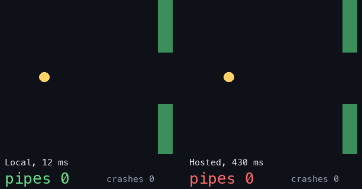

# linearone-local: decisions that arrive on time

**A small classifier in C: ~10-20 ms on one CPU thread, no network, corrected on the fly.** Compared honestly with hosted AI on three games.

## ▶ [Play with it live in your browser](https://arshmakker.github.io/linearone-local/)
Flap race, Snake race, a latency-budget calculator and a playable 2x2 cube with a race. Drag the hosted-latency slider until the bird dies.

| Flap: same answers, 12 ms vs 430 ms | Snake: L1 learning from 25 corrections |
|---|---|
|  |  |

## The one-line finding
**Local wins on speed, not accuracy.** A hosted model handed the right answers scored 0 pipes at its real ~430 ms latency (9 with latency removed). But a plain decision tree beat L1's accuracy in every game, and Claude Opus beat it on Snake and NIST-CSF.

## Where to use it, and where not to
| Use | Why | Evidence |
|---|---|---|
| **First-pass triage** before a bigger model or a human | Answers fast and free, passes the uncertain rest on | NIST-CSF: L1 took the surest 40-50% at 93-97% accuracy; cascade 0.82 vs Opus 0.83, saving 40-50% of Opus calls |
| **Real-time loops** (games, UI, sensors) | ~12-19 ms, no network | Flap: hosted 0 pipes at 430 ms |
| **Instant corrections** without retraining | `TEACH` applies on the next request | Snake: 25 corrections, then plays alone |
| *Offline/private tagging; high-volume cheap routing* | Hypotheses, **not demonstrated here** | none |

**Not for:** accuracy-critical tasks on clear text (use a frontier model), or anything a decision tree or embeddings + logistic regression already handles. Those matched or beat L1's nearest-example rule.

## Results (one run each, held-out seeds)
| Game | What happened |
|---|---|
| **Flap** | Tree and embeddings + LR hit the 9-pipe cap. Hosted with correct answers: 9 at 0 ms, **0 at 430 ms**. L1's own rule: 0-2. |
| **2x2 cube** | Optimal-move rate on 300 unseen states: coin 18%, hosted 18-24%, L1 21%, tree/kNN on stickers 50-63%. Only exact search solves it. |
| **Snake** | L1 ~20 decisions/s vs hosted ~2/s; a tree or embeddings + LR match L1's accuracy. |

Who played: *Jev* = TypeSafe's hosted API (`jev-latest`), *Opus* = Claude Opus via Claude Code subagents, *local LLMs* = llama3.2:3b and qwen2.5 under Ollama. Full named comparison, including where L1 loses, and the players per game: [`COMPARISON.md`](COMPARISON.md). The browser demos are simulations using Jev's measured latency.

## Try it
`make -C snake/c` (needs ONNX Runtime), `pip install -r requirements.txt`, `./fetch_assets.sh`, then `python3 games/flap_bench.py`. Full steps, glossary and limits: [`REPRODUCE.md`](REPRODUCE.md). Method: pre-registered plan with amendments in [`games/PLAN.md`](games/PLAN.md).

## Credits
bge-small-en-v1.5 (BAAI, MIT; int8 build by Xenova), ONNX Runtime (Microsoft, MIT), Jev (TypeSafe AI), Claude Opus (Anthropic), Llama 3.2 (Meta), Qwen2.5 (Alibaba Cloud), Ollama, scikit-learn, NumPy, tokenizers, Pillow; TweetEval (Barbieri et al., CC BY 3.0) and Banking77 (PolyAI) in earlier results. We only call or run these; nothing is redistributed. Names belong to their owners and are used for comparison, not endorsement. "Flap" is our own tiny game, unrelated to any commercial one.

Apache-2.0, see `LICENSE` and `NOTICE`.
