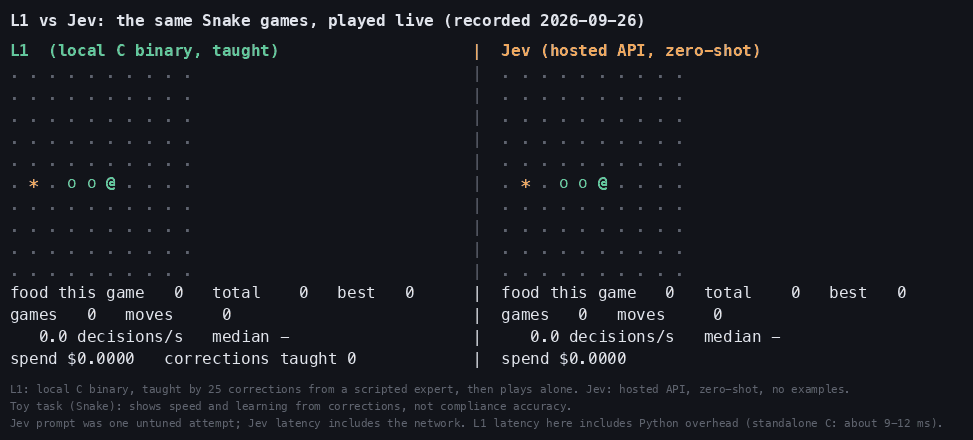

# l1-local: decisions that arrive on time

**A small classifier in C that answers in ~10-20 ms on one CPU thread, with no network, and can be corrected on the fly.**
**▶ Try it in your browser: open [`docs/index.html`](docs/index.html)** (two birds, same correct answers, different speed; a playable 2x2 cube; the Snake clip).

## Why it might interest you
A hosted model can be smart and still lose, because a decision that arrives late is a wrong decision. In our real-time *Flap* game, a hosted model handed the right answers scored **0 pipes at its real ~430 ms latency and 9 (the cap) with latency removed**. A local model answers inside the game loop.

## What it is (and is not)
- `l1score` reads a short text describing a situation ("The next gap is above. The bird is falling.") and picks one of a few options, printing JSON. It embeds the text with a frozen small encoder (bge-small-en-v1.5, int8, via ONNX Runtime) and scores the options.
- You can teach it: `TEACH<TAB>option<TAB>text` adds a corrected example that takes effect on the next request, no retraining. `FORGET` clears them.
- ~10-20 ms per decision (18.7 ms with the 64-token cap used in the cube game) on one thread, about 90 MB of RAM (measured earlier on the original build; not re-measured for this repo).
- **It is not more accurate than simple baselines.** In all three games a decision tree, or logistic regression on the same embeddings, matched or beat L1's nearest-example rule (in Flap L1 scored 0-2 pipes where the tree scored 9). The claim here is speed and instant correction.

## Results at a glance (one run each, held-out seeds)
| Game | What happened |
|---|---|
| **Flap** (real time) | Local models (decision tree, embeddings + logistic regression) hit the 9-pipe cap. A hosted model with correct answers: 9 pipes with latency removed, **0 at its real 430 ms**. L1's own rule: 0-2 pipes. |
| **2x2 cube** | Chance of picking an optimal move on 300 unseen states: coin flip 18%, hosted model 18-24%, L1 21%, embeddings + LR 24-41%, decision tree / kNN on raw stickers 50-63%. Nobody reliably solves it; only the exact search solver does. |
| **Snake** | L1 taught by 25 corrections plays live at ~20 decisions/s; the hosted model at ~2/s. A simple tree or embeddings + LR match L1's accuracy. |
Named comparison with Jev and Opus, including where L1 loses: [`COMPARISON.md`](COMPARISON.md).
Full numbers: `games/flap_run_*.txt`, `games/cube_run.txt`, `games/*_results*.json`.

## How to read the evidence
`games/PLAN.md` is a dated, append-only *pre-registration*: what we would measure and what we expected, written before running, with **amendments** below it that override earlier sections (two bugs were found and fixed before any number was reported, and are documented). Each game was run once.

## Run it yourself
1. Install the ONNX Runtime C library (CPU, 1.x, from the official releases) into `vendor/onnxruntime` (with `include/` and `lib/`), or pass `ORT=/path` to make.
2. `pip install -r requirements.txt`
3. `make -C snake/c` builds `snake/c/l1score`.
4. `./fetch_assets.sh` downloads the int8 encoder (Xenova/bge-small-en-v1.5, MIT) and builds `snake.bin`, `flap.bin`, `cube.bin`.
5. Run: `python3 snake/snake_versus.py --no-jev` (Snake, L1 only), `python3 games/flap_bench.py`, `python3 games/cube_bench.py`.
The hosted-model arms are optional and paid: set `TYPESAFE_API_KEY` and add `--jev`. Hosted answers are cached locally and are not part of this repo.
The tuned nearest-example weight is a build option: `make -C snake/c CFLAGS="-O3 -DDEFAULT_GAMMA=10000.0f" && mv snake/c/l1score snake/c/l1score_g10000`, then `L1BIN=$PWD/snake/c/l1score_g10000 python3 games/flap_bench.py` (cube: `G10000=...`); rebuild the default afterwards.

## Words used here
**L1**: this project's model. **Jev**: a hosted decision API (TypeSafe), used as the "cloud" comparison. **K / N**: number of expert corrections (Flap) / labelled training states (cube). **gamma**: how strongly a taught example pulls the answer. **Nearest-example rule**: answer like the closest taught example. **bge**: the small text-embedding model.

## Layout
`snake/`: Snake demo, baselines, and the C runtime in `snake/c/`. `games/`: Flap and cube benchmarks and `PLAN.md`. `docs/`: the browser demo.

## Limits
Latencies in Flap and cube time-to-solve are injected from measured values, not measured inside a live game. Hosted latency was measured from one laptop. The encoder file you download is a public int8 quantisation and differs slightly from the one behind the committed numbers, so reruns give the same picture but not identical figures (Flap especially depends on which corrections the learner is given). Apache-2.0 licensed (see `LICENSE` and `NOTICE`); bge-small weights are downloaded, not redistributed.
